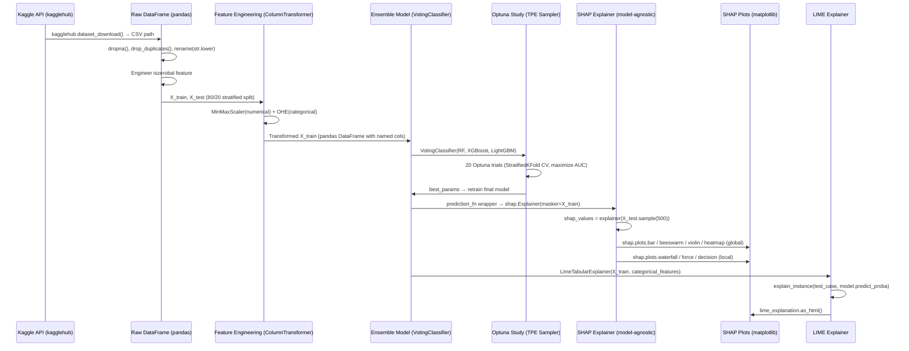
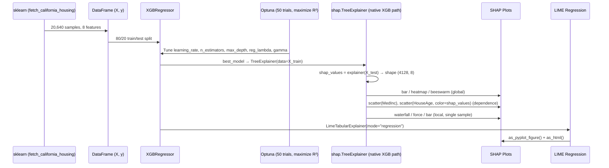

# 🧠 Explainable AI Demos with SHAP

[](https://www.python.org/)
[](https://shap.readthedocs.io/)
[](https://jupyter.org/)
[](https://xgboost.readthedocs.io/)
[](https://lightgbm.readthedocs.io/)
[](LICENSE)
[]()
[]()

> **Understanding the "Why" behind Machine Learning Predictions**

This repository is a production-quality, end-to-end educational framework for **Explainable Artificial Intelligence (XAI)** using the **SHAP (SHapley Additive exPlanations)** library. It addresses one of the most critical pain points in applied machine learning: *the black-box problem* — where high-performing models sacrifice human interpretability, making them unsuitable for high-stakes domains like banking, healthcare, and regulatory compliance. The project delivers four progressively sophisticated Jupyter notebooks that teach practitioners how to explain any ML model, local or globally, using mathematically grounded Shapley values from cooperative game theory. Target audiences include ML engineers, data scientists, AI researchers, and practitioners operating in regulated industries who need to justify model predictions to stakeholders.

### Key Value Propositions

- **Mathematically Rigorous:** SHAP values are grounded in Shapley values from game theory, providing the only attribution method satisfying *local accuracy*, *missingness*, and *consistency* simultaneously — unlike permutation importance or LIME alone.
- **Model-Agnostic and Model-Specific Paths:** Demonstrates both `shap.TreeExplainer` (optimized fast-path for tree ensembles) and the model-agnostic `shap.Explainer` with a custom prediction function wrapper, giving practitioners the full toolkit.
- **Full Explainability Stack:** Covers global interpretability (feature importance rankings across the entire dataset) and local interpretability (per-prediction attribution), bridging the gap between model auditing and end-user explanations.
- **Real-World Datasets:** Uses the Bank Customer Churn dataset (Kaggle, 10,000 rows) and the California Housing dataset (sklearn built-in, 20,640 rows) — not toy data — ensuring transferable, production-relevant insights.
- **SHAP + LIME Cross-Validation:** Each case-study notebook closes with a parallel LIME explanation, allowing practitioners to cross-validate attributions and understand the tradeoffs between the two dominant XAI frameworks.
- **Hyperparameter Optimization Integrated:** Optuna-driven Bayesian search is embedded directly in both case-study notebooks, producing optimally tuned models before explanation — ensuring SHAP is applied to genuinely high-quality models, not naive baselines.
- **Background Data Analysis:** A dedicated notebook (`shap_background_data.ipynb`) isolates and explains the statistical effect of background dataset choice on base values and SHAP magnitude — a nuance absent from most XAI tutorials.

---

## 2. Core Features & Functional Capabilities

### 2.1 SHAP Fundamentals Engine (`shap-intro-demo.ipynb`)

**What it does:** Introduces the complete conceptual and computational foundation of SHAP using the classic Iris multiclass classification dataset and a shallow Random Forest. It demonstrates the full lifecycle: data loading, stratified splitting, label encoding, model training, TreeExplainer instantiation, SHAP value computation, base value verification, and waterfall plot rendering for all three output classes simultaneously.

**Technical mechanism:** Uses `shap.TreeExplainer` with `model_output="probability"`, which configures the explainer to attribute SHAP values in probability space (0–1) rather than raw log-odds. This is architecturally important for multiclass outputs: `shap_values` returns a 3D tensor of shape `(n_samples, n_features, n_classes)`, meaning each feature gets a SHAP value per class per sample. The notebook explicitly slices this tensor (`shap_values[0,:,i]`) to produce per-class waterfall plots.

**Additivity verification:** A key didactic feature is the explicit numerical verification of the SHAP additivity property:

```python
# SHAP additivity: base_value + sum(shap_values) = model_output
(shap_values[0,:,0].base_values + shap_values[0,:,0].values.sum()).round()
```

This teaches practitioners to trust SHAP outputs and detect numerical inconsistencies in custom explainers.

**Design rationale:** Starts with the Iris dataset (150 samples, 4 features, 3 classes) because its simplicity eliminates noise from preprocessing complexity, isolating the SHAP mechanics. The `stratify=y` parameter in `train_test_split` ensures class proportions are preserved in both splits — a best practice often omitted in tutorials.

---

### 2.2 Binary Classification Explainability Pipeline (`classification_shap.ipynb`)

**What it does:** Delivers a full production-grade ML pipeline on the Bank Customer Churn dataset, covering data ingestion via the Kaggle API, EDA, feature engineering, ensemble model building, Bayesian hyperparameter tuning, SHAP global and local explanation generation, and LIME cross-validation.

**Data ingestion pattern:** Uses `kagglehub.dataset_download()` for programmatic, reproducible dataset acquisition:

```python
import kagglehub
path = kagglehub.dataset_download(
    "shubhammeshram579/bank-customer-churn-prediction",
    path="Churn_Modelling.csv"
)
```

This eliminates manual download steps and makes the notebook fully self-contained for CI/CD environments.

**Feature engineering:** The pipeline introduces a derived binary feature `iszerobal` (customers with zero account balance), encoded from `X["balance"].eq(0).astype(int)`. This demonstrates real-world domain knowledge integration — zero-balance customers represent a distinct behavioural segment with different churn propensity.

**Preprocessing architecture:** Uses `sklearn.compose.ColumnTransformer` to apply `MinMaxScaler` to four numerical columns (`creditscore`, `age`, `balance`, `estimatedsalary`) and `OneHotEncoder(handle_unknown="ignore", sparse_output=False)` to two categorical columns (`gender`, `geography`). The `set_config(transform_output="pandas")` call ensures all transformer outputs retain DataFrame structure with named columns — critical for SHAP's feature name lookup.

**Ensemble model — Soft Voting Classifier:** The core predictive model is a soft-voting ensemble of three gradient-boosted tree algorithms:

```python
model = VotingClassifier(
    estimators=[("rf", rf), ("xgb", xgb), ("lgbm", lgbm)],
    voting="soft",
    n_jobs=-1
)
```

Soft voting averages predicted class probabilities (rather than plurality votes), improving calibration and providing smoother probability outputs for SHAP attribution.

**Bayesian hyperparameter tuning with Optuna:** The objective function searches over joint hyperparameter spaces across all three sub-estimators using `trial.suggest_int` and `trial.suggest_float`, optimized via a `StratifiedKFold` cross-validation score:

```python
study = optuna.create_study(direction="maximize")
study.optimize(func=objective, n_trials=20, n_jobs=-1, show_progress_bar=True)
```

`direction="maximize"` targets AUC/F1 maximization. `n_jobs=-1` parallelizes trial execution across all available CPU cores.

**Model-agnostic SHAP wrapper:** Because `VotingClassifier` is not natively supported by `shap.TreeExplainer`, the notebook demonstrates the model-agnostic pattern using a custom prediction function:

```python
def prediction_fn(X):
    return model.predict_proba(X)[:, 1]

explainer = shap.Explainer(
    model=prediction_fn,
    masker=X_train,
    link=shap.links.identity
)
```

`shap.links.identity` specifies that outputs are already in probability space (no logit transformation needed). The `masker=X_train` argument defines the background distribution used to marginalize out feature contributions.

**Global SHAP plots implemented:**
- `shap.plots.bar(shap_values)` — mean absolute SHAP value per feature across all samples
- `shap.plots.beeswarm(shap_values)` — distributional summary showing magnitude and direction of feature effects
- `shap.plots.violin(shap_values)` — violin-enhanced beeswarm for density estimation
- `shap.plots.heatmap(shap_values)` — sample-by-feature SHAP matrix with hierarchical clustering

**Local SHAP plots implemented:**
- `shap.plots.waterfall(row_shap_values, max_display=5)` — single prediction attribution breakdown
- `shap.plots.bar(row_shap_values, max_display=5)` — horizontal bar chart of per-feature contributions
- `shap.plots.force(row_shap_values)` — interactive JavaScript force plot (requires `shap.initjs()`)
- `shap.plots.decision(...)` — decision path visualization tracing cumulative feature contributions

**Batch explanation pattern:** Demonstrates computing SHAP values over a stratified 500-sample batch from the test set (`X_test.sample(500)`), enabling computationally tractable global summaries without requiring full test-set inference.

**LIME cross-validation:** Closes the notebook with a parallel explanation using `LimeTabularExplainer` with explicit `categorical_features` index mapping, `mode="classification"`, and HTML rendering — enabling practitioners to compare LIME's linear surrogate approximation against SHAP's exact Shapley attributions.

---

### 2.3 Regression Explainability Pipeline (`regression_shap.ipynb`)

**What it does:** Applies the full SHAP explainability stack to a regression task using the California Housing dataset and a tuned XGBoost regressor, covering global and local interpretability with scatter/dependence plots that are unique to regression contexts.

**Dataset:** California Housing (sklearn built-in, 20,640 samples, 8 features: `MedInc`, `HouseAge`, `AveRooms`, `AveBedrms`, `Population`, `AveOccup`, `Latitude`, `Longitude`). Target variable is median house value in units of $100,000.

**Model architecture:** XGBoost Regressor with `objective='reg:squarederror'`:

```python
xgb_model = XGBRegressor(
    objective='reg:squarederror',
    random_state=42,
    n_jobs=-1,
    learning_rate=0.2,
    n_estimators=200,
    reg_lambda=50,
    max_depth=7,
    gamma=0.05
)
```

`reg_lambda=50` applies strong L2 regularization to prevent overfitting on this moderately sized dataset. `gamma=0.05` introduces minimum loss reduction for splits, pruning insignificant branches.

**Optuna tuning for regression:** The objective function maximizes R² score via 5-fold cross-validation, searching `learning_rate`, `n_estimators`, `max_depth`, `reg_lambda`, `gamma`, and `subsample` hyperparameters across 50 trials.

**Regression-specific SHAP explainer:** Uses `shap.TreeExplainer` directly (since XGBRegressor is natively supported), without the model-agnostic wrapper needed for the VotingClassifier:

```python
explainer = shap.TreeExplainer(model=best_model, data=X_train)
shap_values = explainer(X_test)  # shape: (n_test_samples, n_features)
```

For regression, `shap_values` is a 2D tensor — no class dimension — and values are in the original target unit (house value × $100k).

**Feature importance extraction:** The notebook demonstrates programmatic extraction of mean absolute SHAP values into a sorted dictionary:

```python
feature_importances = {
    feature: shap_val.item()
    for feature, shap_val in zip(feature_names, shap_values.abs.mean(axis=0).values)
}
sorted(feature_importances, key=feature_importances.get, reverse=True)
```

**Scatter/Dependence plots:** Unique to regression, the notebook demonstrates `shap.plots.scatter()` for dependence analysis — plotting SHAP value vs. raw feature value for individual features, with optional interaction coloring:

```python
shap.plots.scatter(shap_values[:, "MedInc"])
shap.plots.scatter(shap_values[:, "HouseAge"], color=shap_values)  # interaction coloring
```

**LIME regression integration:** `LimeTabularExplainer` in `mode="regression"` with `predict_fn=xgb_model.predict`, outputting both a `pyplot` figure and an interactive HTML panel.

---

### 2.4 Background Data Effect Analysis (`shap_background_data.ipynb`)

**What it does:** Isolates and quantifies the statistical effect of background dataset selection on SHAP base values and attributions — a nuanced topic that directly impacts the interpretability of SHAP outputs in production.

**Synthetic dataset design:** Uses a programmatically generated binary placement dataset (`knows_python`, `knows_genai`) with a deterministic logical OR target (`placement = knows_python OR knows_genai`):

```python
np.random.seed(20)
df = pd.DataFrame({
    "knows_python": np.random.choice([0, 1], size=1000),
    "knows_genai": np.random.choice([0, 1], size=1000)
})
df["placement"] = df.any(axis=1).astype(int)
```

The known ground truth (OR logic) allows practitioners to verify whether SHAP correctly attributes causality.

**Three background data regimes compared:**
1. **All training data** (`background_data_all = X_train`): Base value ≈ mean predicted probability across the full training distribution.
2. **Positive-class only** (`background_data_pos = X_train.loc[y_train == 1, :]`): Base value shifts upward, reflecting a higher-probability reference distribution — SHAP values reflect deviation from "always placed" baseline.
3. **Negative-class only** (`background_data_neg = X_train.loc[y_train == 0, :]`): Base value shifts downward — SHAP values reflect deviation from "never placed" baseline.

**Reusable explanation utility:** The notebook introduces `calculate_and_plot_shap()` — a parameterized function accepting `background_data` and `test_case`, encapsulating explainer construction, SHAP computation, and waterfall rendering:

```python
def calculate_and_plot_shap(background_data, test_case):
    explainer = shap.TreeExplainer(
        model=gb,
        data=background_data,
        model_output="probability"
    )
    shap_values = explainer(test_case)
    display(test_case)
    print(f"Base Value: {shap_values.base_values.item()}")
    print(f"SHAP Values: {shap_values.values.ravel()}")
    shap.plots.waterfall(shap_values[0])
```

This reusable pattern is directly applicable to production monitoring pipelines where background data is periodically refreshed.

---

## 3. Tech Stack & System Architecture

### 3.1 Tech Stack Breakdown

| Component | Technology | Version | Justification |
|---|---|---|---|
| Language | Python | 3.13 | Latest stable CPython release; required for `>=3.10` syntax features used in type annotations |
| XAI Framework | SHAP | 0.48.0 | Primary explainability library; native TreeExplainer optimized for tree models via C++ backend |
| Gradient Boosting (1) | XGBoost | 3.0.4 | Industry-standard gradient boosting; natively supported by `shap.TreeExplainer` |
| Gradient Boosting (2) | LightGBM | 4.6.0 | Histogram-based GBDT; faster training than XGBoost on high-cardinality features |
| Deep Learning | TensorFlow / Keras | 2.20.0 / 3.11.3 | Included as dependency for potential neural network extension; Keras 3 is backend-agnostic |
| Deep Learning (alt) | PyTorch / Torchvision | 2.8.0 / 0.23.0 | Alternative DL backend; enables `shap.DeepExplainer` for neural nets |
| ML Framework | scikit-learn | 1.7.1 | Core ML primitives: preprocessing, model selection, metrics, datasets |
| Data Manipulation | pandas | 2.3.1 | Primary DataFrame library; `set_config(transform_output="pandas")` preserves column names through sklearn pipelines |
| Numerical Computing | NumPy | 2.2.6 | Array operations; SHAP value tensor manipulation |
| Visualization | Matplotlib | 3.10.5 | Base rendering backend for all SHAP plots |
| Visualization | Seaborn | 0.13.2 | Statistical plot styling; EDA distribution plots |
| Hyperparameter Optimization | Optuna | 4.5.0 | Bayesian optimization via Tree-structured Parzen Estimator (TPE) |
| Alternative XAI | LIME | 0.2.0.1 | Local Interpretable Model-agnostic Explanations; cross-validation against SHAP |
| Feature Engineering | feature-engine | 1.9.3 | Extended sklearn-compatible feature transformers |
| Notebook Runtime | ipykernel / ipython | 6.30.1 / 9.4.0 | Jupyter kernel and interactive Python shell |
| Dataset Acquisition | kagglehub | 0.3.13 | Programmatic Kaggle dataset download without manual authentication UI |
| Package Manager | uv (pyproject.toml) | — | PEP 517/518 compliant build backend; dependency resolution via `pyproject.toml` |
| Numerical Optimization | SciPy | 1.16.1 | Statistical distributions; optimization routines used internally by SHAP |
| JIT Compilation | Numba / llvmlite | 0.61.2 / 0.44.0 | LLVM-based JIT for numerical kernel acceleration in SHAP internals |
| Image Processing | scikit-image / Pillow | 0.25.2 / 11.3.0 | Image utilities; used by torchvision transforms |
| Statistical Modeling | statsmodels | 0.14.5 | Statistical tests and regression diagnostics |

---

### 3.2 Directory Structure

```
Explainable-AI-Demos-with-SHAP-main/
│
├── .python-version                   # Pin file: specifies Python 3.13 for pyenv/uv
│
├── pyproject.toml                    # PEP 517/518 project manifest:
│                                     #   - Project name: shap-project v0.1.0
│                                     #   - requires-python = ">=3.10"
│                                     #   - All core + deep learning dependencies declared
│                                     #   - dev group: ipykernel for notebook execution
│
├── requirements.txt                  # Fully pinned lockfile (pip freeze output):
│                                     #   - 80+ packages with exact versions
│                                     #   - Ensures 100% reproducible environments
│                                     #   - Includes transitive dependencies
│
├── main.py                           # Minimal package entrypoint:
│                                     #   - def main(): print("Hello from shap-project!")
│                                     #   - Placeholder for future CLI tool integration
│                                     #   - __main__ guard for direct execution
│
├── README.md                         # Original project README (this file replaces it)
│
├── shap-intro-demo.ipynb             # Notebook 1 — SHAP Fundamentals:
│                                     #   - Iris dataset (150 samples, 4 features, 3 classes)
│                                     #   - RandomForestClassifier (max_depth=5, n_estimators=10)
│                                     #   - TreeExplainer with model_output="probability"
│                                     #   - Multiclass waterfall plots, additivity verification
│                                     #   - 42 cells
│
├── classification_shap.ipynb         # Notebook 2 — Binary Classification Case Study:
│                                     #   - Bank Churn dataset (10,000 rows, Kaggle)
│                                     #   - Full EDA, feature engineering, ColumnTransformer
│                                     #   - Soft VotingClassifier (RF + XGBoost + LightGBM)
│                                     #   - Optuna tuning (20 trials, StratifiedKFold)
│                                     #   - Model-agnostic SHAP Explainer (prediction_fn wrapper)
│                                     #   - Global + local SHAP plots
│                                     #   - LIME cross-validation
│                                     #   - 122 cells
│
├── regression_shap.ipynb             # Notebook 3 — Regression Case Study:
│                                     #   - California Housing dataset (20,640 rows)
│                                     #   - XGBRegressor with L2 regularization
│                                     #   - Optuna tuning (50 trials, R² maximization)
│                                     #   - TreeExplainer (native XGBoost path)
│                                     #   - Global + local SHAP + scatter/dependence plots
│                                     #   - LIME regression cross-validation
│                                     #   - 71 cells
│
└── shap_background_data.ipynb        # Notebook 4 — Background Data Effect Analysis:
                                      #   - Synthetic OR-logic placement dataset (1000 rows)
                                      #   - GradientBoostingClassifier (10 estimators)
                                      #   - Compares: full / positive-only / negative-only background
                                      #   - Reusable calculate_and_plot_shap() utility
                                      #   - 39 cells
```

---

### 3.3 Architectural Flow

The following Mermaid diagram traces the data flow through the full classification pipeline, from raw data to SHAP explanations:





---

## 4. Database Schema & Data Models

This project operates in a stateless notebook computation paradigm — there is no persistent relational or NoSQL database. All data is held in-memory as pandas DataFrames during notebook execution. The following section documents the schema of all datasets used, their transformations, and the resulting in-memory data models.

### 4.1 Bank Churn Dataset Schema (Classification Notebook)

**Source:** Kaggle — `shubhammeshram579/bank-customer-churn-prediction` → `Churn_Modelling.csv`

**Raw schema (before preprocessing):**

| Field Name | Data Type | Constraints | Description / Purpose |
|---|---|---|---|
| `RowNumber` | int64 | Dropped (index artifact) | Row index; discarded before modelling |
| `CustomerId` | int64 | Dropped (PII surrogate) | Unique customer identifier; no predictive signal |
| `Surname` | object | Dropped (PII) | Customer surname; legally sensitive, no signal |
| `CreditScore` | int64 | Not Null, 350–850 | Customer credit score |
| `Geography` | object | Not Null, {France, Germany, Spain} | Country of residence; OneHot encoded |
| `Gender` | object | Not Null, {Male, Female} | Customer gender; OneHot encoded |
| `Age` | int64 | Not Null, 18–92 | Customer age in years |
| `Tenure` | int64 | Not Null, 0–10 | Number of years as bank customer |
| `Balance` | float64 | Not Null, ≥ 0 | Account balance in EUR |
| `NumOfProducts` | int64 | Not Null, 1–4 | Number of bank products subscribed |
| `HasCrCard` | int64 | Binary {0, 1} | Whether customer holds a credit card |
| `IsActiveMember` | int64 | Binary {0, 1} | Whether customer is an active member |
| `EstimatedSalary` | float64 | Not Null, > 0 | Estimated annual salary in EUR |
| `Exited` | int64 | Binary {0, 1}, Target | Whether customer churned (1=Yes) |

**Engineered features (post-EDA):**

| Field Name | Data Type | Derivation | Description / Purpose |
|---|---|---|---|
| `iszerobal` | int64 | `balance.eq(0).astype(int)` | Binary flag for zero-balance customers; domain-driven feature capturing a distinct behavioural segment |

**Post-preprocessing schema (fed to model):**

| Field Name | Data Type | Transformer | Description |
|---|---|---|---|
| `scaler__creditscore` | float64 | MinMaxScaler | Normalized credit score [0, 1] |
| `scaler__age` | float64 | MinMaxScaler | Normalized age [0, 1] |
| `scaler__balance` | float64 | MinMaxScaler | Normalized balance [0, 1] |
| `scaler__estimatedsalary` | float64 | MinMaxScaler | Normalized salary [0, 1] |
| `encoder__gender_Female` | float64 | OHE | Binary: is gender Female |
| `encoder__gender_Male` | float64 | OHE | Binary: is gender Male |
| `encoder__geography_France` | float64 | OHE | Binary: is from France |
| `encoder__geography_Germany` | float64 | OHE | Binary: is from Germany |
| `encoder__geography_Spain` | float64 | OHE | Binary: is from Spain |
| `remainder__tenure` | int64 | Pass-through | Years as customer (unchanged) |
| `remainder__numofproducts` | int64 | Pass-through | Product count (unchanged) |
| `remainder__hascrcard` | int64 | Pass-through | Credit card flag (unchanged) |
| `remainder__isactivemember` | int64 | Pass-through | Active member flag (unchanged) |
| `remainder__iszerobal` | int64 | Pass-through | Zero balance flag (unchanged) |

**Shape:** Training set: (7,997, 14) · Test set: (2,000, 14) after deduplication and missing row removal.

---

### 4.2 California Housing Dataset Schema (Regression Notebook)

**Source:** `sklearn.datasets.fetch_california_housing()` — built-in dataset, no download required.

| Field Name | Data Type | Range | Description / Purpose |
|---|---|---|---|
| `MedInc` | float64 | 0.5–15.0 | Median income in block group ($10,000s) |
| `HouseAge` | float64 | 1–52 | Median house age in block group (years) |
| `AveRooms` | float64 | 1.1–141.9 | Average number of rooms per household |
| `AveBedrms` | float64 | 1.0–34.1 | Average number of bedrooms per household |
| `Population` | float64 | 3–35,682 | Block group population |
| `AveOccup` | float64 | 0.7–1,243.3 | Average household occupancy (residents/household) |
| `Latitude` | float64 | 32.5–41.9 | Block group latitude |
| `Longitude` | float64 | −124.4 to −114.3 | Block group longitude |
| `MedHouseVal` | float64 | 0.15–5.0, **Target** | Median house value ($100,000s) |

**Shape:** Training set: (16,512, 8) · Test set: (4,128, 8).

---

### 4.3 Synthetic Placement Dataset Schema (Background Data Notebook)

**Source:** Programmatically generated with `numpy.random.seed(20)`.

| Field Name | Data Type | Domain | Description / Purpose |
|---|---|---|---|
| `knows_python` | int64 | Binary {0, 1} | Whether individual knows Python |
| `knows_genai` | int64 | Binary {0, 1} | Whether individual knows Generative AI |
| `placement` | int64 | Binary {0, 1}, **Target** | Placed = knows_python OR knows_genai |

**Shape:** 1,000 rows total. Training: (800, 2). Test: (200, 2).

---

### 4.4 Iris Dataset Schema (Intro Notebook)

**Source:** `shap.datasets.iris()` — SHAP's packaged version of the classic Fisher Iris dataset.

| Field Name | Data Type | Range | Description / Purpose |
|---|---|---|---|
| `sepal length (cm)` | float64 | 4.3–7.9 | Sepal length measurement |
| `sepal width (cm)` | float64 | 2.0–4.4 | Sepal width measurement |
| `petal length (cm)` | float64 | 1.0–6.9 | Petal length measurement |
| `petal width (cm)` | float64 | 0.1–2.5 | Petal width measurement |
| `species` | object | {setosa, versicolor, virginica}, **Target** | Iris species class label |

**Shape:** 150 rows · 4 features · 3 classes. Training: (120, 4). Test: (30, 4).

---

## 5. Explainability API Reference & Integration Guide

This project is a computational notebook framework, not an HTTP API service. This section documents the core SHAP and LIME programmatic interfaces used throughout the notebooks as a practical integration reference for practitioners embedding these patterns in production systems.

### 5.1 `shap.TreeExplainer` — Tree-Optimized Explainer

**Use when:** The model is a tree-based algorithm natively supported by SHAP (RandomForest, XGBoost, LightGBM, GradientBoosting, CatBoost, etc.).

**Constructor:**
```python
explainer = shap.TreeExplainer(
    model=rf,                          # Fitted sklearn/xgb/lgbm model
    data=X_train,                      # Background data for interventional TreeSHAP
    model_output="probability"         # "probability" | "log_loss" | "raw" (default)
)
```

**Parameter reference:**

| Parameter | Type | Default | Description |
|---|---|---|---|
| `model` | fitted estimator | required | Any SHAP-compatible tree model |
| `data` | DataFrame or ndarray | `None` | Background dataset; enables interventional TreeSHAP. When `None`, uses path-dependent TreeSHAP (no background needed but different semantics) |
| `model_output` | str | `"raw"` | Output space for SHAP values. `"probability"` gives attributions in probability units; `"raw"` gives log-odds for classifiers, raw prediction for regressors |

**Computing SHAP values:**
```python
shap_values = explainer(X_test)
# Returns: shap.Explanation object
# shap_values.values       → ndarray (n_samples, n_features) for regression
#                            ndarray (n_samples, n_features, n_classes) for multiclass
# shap_values.base_values  → ndarray: model's expected output (base value)
# shap_values.data         → ndarray: raw feature values for each sample
```

**Additivity verification (always recommended):**
```python
# For a single sample i, class c:
assert abs(
    shap_values[i, :, c].base_values + shap_values[i, :, c].values.sum()
    - model.predict_proba(X_test.iloc[[i]])[:, c]
) < 1e-4, "Additivity violated — check model_output alignment"
```

---

### 5.2 `shap.Explainer` — Model-Agnostic Explainer

**Use when:** The model is not natively supported by TreeExplainer (e.g., VotingClassifier, custom pipelines, neural networks) or when a model-agnostic wrapper is required for consistency.

**Constructor:**
```python
def prediction_fn(X):
    return model.predict_proba(X)[:, 1]   # Return 1D probability array

explainer = shap.Explainer(
    model=prediction_fn,
    masker=X_train,                         # Background distribution
    link=shap.links.identity               # identity | logit
)
```

**Parameter reference:**

| Parameter | Type | Default | Description |
|---|---|---|---|
| `model` | callable | required | Any function accepting a 2D array and returning predictions |
| `masker` | DataFrame or ndarray | required | Training data used to marginalize out feature effects during explanation |
| `link` | shap.links function | `identity` | Transformation applied to model output; use `shap.links.logit` if model returns log-odds |

**Computing SHAP values:**
```python
shap_values = explainer(X_test.iloc[[0], :])  # Single sample
shap_values = explainer(X_test.sample(500))   # Batch (500 samples)
```

**Performance note:** Model-agnostic SHAP (Kernel SHAP) is computationally intensive — O(2^n_features) coalitions per sample. For high-dimensional data (>50 features), always sample the explanation set (`X_test.sample(500)` rather than full test set) or use `max_evals` parameter to cap function evaluations.

---

### 5.3 SHAP Global Visualization Interface

All global plots accept a SHAP `Explanation` object computed over a multi-sample batch.

```python
# Bar plot — mean |SHAP| per feature
shap.plots.bar(shap_values)
shap.plots.bar(shap_values, max_display=10)   # limit to top-10 features

# Beeswarm (summary) — distribution of SHAP values per feature
shap.plots.beeswarm(shap_values)
shap.plots.beeswarm(shap_values, max_display=15, order=shap_values.abs.mean(0))

# Violin — density-enhanced beeswarm
shap.plots.violin(shap_values)

# Heatmap — sample × feature SHAP matrix
shap.plots.heatmap(shap_values)
shap.plots.heatmap(shap_values, max_display=10, instance_order=shap_values.sum(1))

# Scatter/Dependence — SHAP vs. raw feature value
shap.plots.scatter(shap_values[:, "MedInc"])
shap.plots.scatter(shap_values[:, "HouseAge"], color=shap_values)  # interaction coloring
```

---

### 5.4 SHAP Local Visualization Interface

All local plots accept a single-sample SHAP `Explanation` object (index `[0]` from a batch).

```python
row_shap = explainer(X_test.iloc[[i], :])

# Waterfall — step-by-step feature contribution breakdown
shap.plots.waterfall(row_shap[0])
shap.plots.waterfall(row_shap[0], max_display=10)

# Force plot — interactive push/pull visualization
shap.initjs()                              # Must be called once per session
shap.plots.force(row_shap[0])

# Bar — horizontal bar chart of SHAP attributions
shap.plots.bar(row_shap[0], max_display=10)

# Decision — cumulative path from base value to prediction
shap.plots.decision(
    shap_values=row_shap[0].values,
    base_value=row_shap[0].base_values,
    feature_names=X_test.columns.tolist()
)
```

---

### 5.5 LIME Integration Interface

```python
from lime.lime_tabular import LimeTabularExplainer

# Classification
lime_explainer = LimeTabularExplainer(
    training_data=X_train.values,            # ndarray required (not DataFrame)
    mode="classification",                   # "classification" | "regression"
    feature_names=preprocessor.get_feature_names_out().tolist(),
    categorical_features=[4, 5, 6, 7, 8, 11, 12, 13]  # column indices of OHE features
)

lime_explanation = lime_explainer.explain_instance(
    data_row=test_case.values.flatten(),     # 1D array
    predict_fn=model.predict_proba           # Must return 2D (n_samples, n_classes)
)

# Output formats
lime_explanation.as_list()                  # [(feature_condition, weight), ...]
lime_explanation.as_pyplot_figure()         # matplotlib Figure
lime_explanation.as_html()                  # Interactive HTML string

# Regression
lime_explainer_reg = LimeTabularExplainer(
    training_data=X_train.values,
    mode="regression",
    feature_names=X_train.columns.tolist()
)

lime_explanation_reg = lime_explainer_reg.explain_instance(
    data_row=test_case.values.flatten(),
    predict_fn=xgb_model.predict            # Must return 1D array
)
```

---

### 5.6 Optuna Hyperparameter Optimization Interface

```python
import optuna
from sklearn.model_selection import cross_val_score, StratifiedKFold

def objective(trial: optuna.Trial):
    params_dict = {
        "rf__n_estimators": trial.suggest_int("rf__n_estimators", 50, 200),
        "rf__max_depth": trial.suggest_int("rf__max_depth", 5, 30),
        "xgb__n_estimators": trial.suggest_int("xgb__n_estimators", 50, 200),
        "xgb__max_depth": trial.suggest_int("xgb__max_depth", 3, 10),
        "xgb__learning_rate": trial.suggest_float("xgb__learning_rate", 0.01, 0.3, log=True),
        "lgbm__n_estimators": trial.suggest_int("lgbm__n_estimators", 50, 200),
        "lgbm__max_depth": trial.suggest_int("lgbm__max_depth", 3, 10),
        "lgbm__learning_rate": trial.suggest_float("lgbm__learning_rate", 0.01, 0.3, log=True),
    }
    model.set_params(**params_dict)
    cv = StratifiedKFold(n_splits=5, shuffle=True, random_state=42)
    return cross_val_score(model, X_train, y_train, cv=cv, scoring="roc_auc").mean()

study = optuna.create_study(direction="maximize")
study.optimize(func=objective, n_trials=20, n_jobs=-1, show_progress_bar=True)

print(f"Best AUC: {study.best_value:.4f}")
print(f"Best params: {study.best_params}")
```

---

## 6. Installation, Configuration & Environment

### 6.1 Prerequisites

| Prerequisite | Minimum Version | Installation Guide |
|---|---|---|
| Python | 3.10 (3.13 recommended) | [python.org](https://www.python.org/downloads/) or via `pyenv` |
| pip | 23.0+ | Bundled with Python; upgrade via `pip install --upgrade pip` |
| uv (recommended) | 0.5.0+ | `curl -LsSf https://astral.sh/uv/install.sh \| sh` |
| Git | 2.30+ | [git-scm.com](https://git-scm.com/) |
| Kaggle account | — | Required only for the classification notebook; [kaggle.com/settings](https://www.kaggle.com/settings) → API → Create New Token |
| Jupyter | 7.0+ | Installed automatically via `ipykernel` dependency |
| 8 GB RAM | — | Recommended; XGBoost Optuna tuning with `n_jobs=-1` is memory-intensive |
| 4 GB disk | — | For Kaggle dataset cache and Python environment |

---

### 6.2 Kaggle API Configuration

The classification notebook uses `kagglehub` for automated dataset download. Authentication requires a Kaggle API token:

1. Log in to [kaggle.com](https://www.kaggle.com)
2. Navigate to **Settings → API → Create New Token**
3. This downloads `kaggle.json` containing your credentials
4. Place the file in the correct location:

```bash
# Linux / macOS
mkdir -p ~/.config/kaggle
mv ~/Downloads/kaggle.json ~/.config/kaggle/kaggle.json
chmod 600 ~/.config/kaggle/kaggle.json

# Windows (PowerShell)
New-Item -ItemType Directory -Force "$env:USERPROFILE\.config\kaggle"
Move-Item "$env:USERPROFILE\Downloads\kaggle.json" "$env:USERPROFILE\.config\kaggle\kaggle.json"
```

`kaggle.json` structure:
```json
{
  "username": "your_kaggle_username",
  "key": "your_32_character_api_key_here"
}
```

**Environment variable alternative** (preferred for CI/CD):
```bash
export KAGGLE_USERNAME="your_kaggle_username"
export KAGGLE_KEY="your_32_character_api_key_here"
```

The `kagglehub` library automatically reads from `~/.config/kaggle/kaggle.json` or `KAGGLE_USERNAME`/`KAGGLE_KEY` environment variables. No `.env` file is required for non-Kaggle notebooks — the California Housing and Iris datasets are downloaded automatically by scikit-learn and SHAP respectively.

---

### 6.3 Step-by-Step Local Setup

#### Option A: Using `uv` (Recommended — Fastest)

```bash
# 1. Clone the repository
git clone https://github.com/wittyswayam/Explainable-AI-Demos-with-SHAP.git
cd Explainable-AI-Demos-with-SHAP

# 2. Install uv if not already installed
curl -LsSf https://astral.sh/uv/install.sh | sh
source ~/.bashrc  # or restart terminal

# 3. Create virtual environment with Python 3.13 (reads .python-version automatically)
uv venv .venv --python 3.13

# 4. Activate the virtual environment
# Linux / macOS:
source .venv/bin/activate
# Windows (PowerShell):
.venv\Scripts\Activate.ps1

# 5. Install all dependencies from pyproject.toml
uv sync

# 6. Register the virtual environment as a Jupyter kernel
python -m ipykernel install --user --name shap-project --display-name "shap-project"

# 7. Launch Jupyter
jupyter notebook
# Jupyter will open at http://localhost:8888 in your default browser
```

#### Option B: Using `pip` with `requirements.txt` (Exact Reproducibility)

```bash
# 1. Clone the repository
git clone https://github.com/wittyswayam/Explainable-AI-Demos-with-SHAP.git
cd Explainable-AI-Demos-with-SHAP

# 2. Create and activate virtual environment
python3.13 -m venv .venv
source .venv/bin/activate          # Linux / macOS
# .venv\Scripts\activate           # Windows

# 3. Upgrade pip
pip install --upgrade pip setuptools wheel

# 4. Install all pinned dependencies
pip install -r requirements.txt

# 5. Register Jupyter kernel
python -m ipykernel install --user --name shap-project --display-name "shap-project"

# 6. Configure Kaggle credentials (for classification notebook only)
mkdir -p ~/.config/kaggle
echo '{"username":"YOUR_USERNAME","key":"YOUR_API_KEY"}' > ~/.config/kaggle/kaggle.json
chmod 600 ~/.config/kaggle/kaggle.json

# 7. Launch Jupyter
jupyter notebook
```

#### Option C: Using `conda`

```bash
# 1. Clone the repository
git clone https://github.com/wittyswayam/Explainable-AI-Demos-with-SHAP.git
cd Explainable-AI-Demos-with-SHAP

# 2. Create conda environment
conda create -n shap-env python=3.13 -y
conda activate shap-env

# 3. Install pip dependencies
pip install -r requirements.txt

# 4. Register kernel
python -m ipykernel install --user --name shap-env --display-name "SHAP Environment"

# 5. Launch Jupyter
jupyter notebook
```

#### Verifying Installation

```python
# Run this in a Jupyter cell to verify all critical packages:
import shap; print(f"SHAP: {shap.__version__}")
import sklearn; print(f"scikit-learn: {sklearn.__version__}")
import xgboost; print(f"XGBoost: {xgboost.__version__}")
import lightgbm; print(f"LightGBM: {lightgbm.__version__}")
import optuna; print(f"Optuna: {optuna.__version__}")
import lime; print(f"LIME: {lime.__version__}")
import pandas; print(f"pandas: {pandas.__version__}")
print("✅ All packages loaded successfully")
```

Expected output:
```
SHAP: 0.48.0
scikit-learn: 1.7.1
XGBoost: 3.0.4
LightGBM: 4.6.0
Optuna: 4.5.0
LIME: 0.2.0.1
pandas: 2.3.1
✅ All packages loaded successfully
```

---

### 6.4 Recommended Notebook Execution Order

| Step | Notebook | Dataset | Estimated Runtime | GPU Required |
|---|---|---|---|---|
| 1 | `shap-intro-demo.ipynb` | Iris (150 rows) | ~30 seconds | No |
| 2 | `shap_background_data.ipynb` | Synthetic (1,000 rows) | ~1 minute | No |
| 3 | `regression_shap.ipynb` | California Housing (20,640 rows) | ~5–15 minutes (Optuna 50 trials) | No |
| 4 | `classification_shap.ipynb` | Bank Churn (10,000 rows) | ~10–20 minutes (Optuna 20 trials) | No |

Set the kernel to **shap-project** (or your environment name) before running each notebook: **Kernel → Change Kernel → shap-project**.

---

## 7. Running Tests, Linting & CI/CD

### 7.1 Current Test Coverage

This repository is a data science exploration project structured as interactive Jupyter notebooks. Formal unit test suites (pytest, unittest) are not included in the current iteration. The notebooks themselves serve as integration tests — successful end-to-end execution from data loading through SHAP plot rendering constitutes functional validation.

**Manual notebook validation:**
```bash
# Execute all cells in a notebook non-interactively (CI-compatible)
pip install nbconvert

# Run intro demo
jupyter nbconvert --to notebook --execute shap-intro-demo.ipynb \
    --output executed/shap-intro-demo-executed.ipynb \
    --ExecutePreprocessor.timeout=300

# Run background data notebook
jupyter nbconvert --to notebook --execute shap_background_data.ipynb \
    --output executed/shap_background_data-executed.ipynb \
    --ExecutePreprocessor.timeout=300

# Run regression notebook (longer due to Optuna)
jupyter nbconvert --to notebook --execute regression_shap.ipynb \
    --output executed/regression_shap-executed.ipynb \
    --ExecutePreprocessor.timeout=1800

# Run classification notebook (Kaggle credentials required)
KAGGLE_USERNAME=your_user KAGGLE_KEY=your_key \
    jupyter nbconvert --to notebook --execute classification_shap.ipynb \
    --output executed/classification_shap-executed.ipynb \
    --ExecutePreprocessor.timeout=1800
```

### 7.2 Code Quality & Linting

The project uses standard Python tooling for code quality enforcement. Install dev tools:

```bash
pip install ruff black isort nbqa
```

**Linting notebooks with `nbqa` (runs linters on notebook cell code):**
```bash
# Run ruff linter on all notebooks
nbqa ruff shap-intro-demo.ipynb classification_shap.ipynb regression_shap.ipynb shap_background_data.ipynb

# Auto-fix ruff issues
nbqa ruff --fix shap-intro-demo.ipynb

# Format notebook code cells with black
nbqa black shap-intro-demo.ipynb classification_shap.ipynb regression_shap.ipynb shap_background_data.ipynb

# Sort imports in notebooks
nbqa isort shap-intro-demo.ipynb classification_shap.ipynb regression_shap.ipynb shap_background_data.ipynb
```

**Linting `main.py`:**
```bash
ruff check main.py
black main.py
```

### 7.3 CI/CD Workflow (Recommended GitHub Actions)

The repository does not currently ship a `.github/workflows/` directory. The following is the recommended CI configuration for automated notebook validation on push:

```yaml
# .github/workflows/notebook-ci.yml
name: Notebook CI

on:
  push:
    branches: [main, develop]
  pull_request:
    branches: [main]

jobs:
  validate-notebooks:
    runs-on: ubuntu-latest
    
    steps:
      - uses: actions/checkout@v4
      
      - name: Set up Python 3.13
        uses: actions/setup-python@v5
        with:
          python-version: "3.13"
      
      - name: Cache pip packages
        uses: actions/cache@v4
        with:
          path: ~/.cache/pip
          key: ${{ runner.os }}-pip-${{ hashFiles('requirements.txt') }}
      
      - name: Install dependencies
        run: |
          python -m pip install --upgrade pip
          pip install -r requirements.txt
          pip install nbconvert nbqa ruff
      
      - name: Lint notebooks
        run: |
          nbqa ruff shap-intro-demo.ipynb shap_background_data.ipynb regression_shap.ipynb
      
      - name: Execute lightweight notebooks
        run: |
          jupyter nbconvert --to notebook --execute shap-intro-demo.ipynb \
              --ExecutePreprocessor.timeout=300
          jupyter nbconvert --to notebook --execute shap_background_data.ipynb \
              --ExecutePreprocessor.timeout=300
      
      - name: Execute regression notebook
        run: |
          jupyter nbconvert --to notebook --execute regression_shap.ipynb \
              --ExecutePreprocessor.timeout=1800
      
      - name: Execute classification notebook
        env:
          KAGGLE_USERNAME: ${{ secrets.KAGGLE_USERNAME }}
          KAGGLE_KEY: ${{ secrets.KAGGLE_KEY }}
        run: |
          jupyter nbconvert --to notebook --execute classification_shap.ipynb \
              --ExecutePreprocessor.timeout=1800
```

**Required GitHub Secrets:** `KAGGLE_USERNAME`, `KAGGLE_KEY` (set under Settings → Secrets and Variables → Actions).

---

## 8. Production Deployment & Best Practices

### 8.1 Containerization with Docker

For reproducible deployment of the Jupyter environment across teams or cloud platforms:

```dockerfile
# Dockerfile
FROM python:3.13-slim

LABEL maintainer="your-email@example.com"
LABEL description="Explainable AI with SHAP — Jupyter notebook environment"

# Set working directory
WORKDIR /workspace

# Install system dependencies required by numpy, scipy, and LightGBM
RUN apt-get update && apt-get install -y --no-install-recommends \
    build-essential \
    libgomp1 \
    curl \
    git \
    && rm -rf /var/lib/apt/lists/*

# Copy dependency files first (layer caching optimization)
COPY requirements.txt pyproject.toml ./

# Install Python dependencies
RUN pip install --no-cache-dir --upgrade pip && \
    pip install --no-cache-dir -r requirements.txt && \
    pip install --no-cache-dir notebook jupyter

# Copy notebooks
COPY *.ipynb ./
COPY main.py ./

# Create non-root user for security
RUN useradd -m -u 1000 jupyter && chown -R jupyter:jupyter /workspace
USER jupyter

# Expose Jupyter port
EXPOSE 8888

# Configure Jupyter (disable token for local dev; use token/password for production)
ENV JUPYTER_TOKEN="your-secure-token-here"

CMD ["jupyter", "notebook", \
     "--ip=0.0.0.0", \
     "--port=8888", \
     "--no-browser", \
     "--NotebookApp.token=${JUPYTER_TOKEN}"]
```

```yaml
# docker-compose.yml
version: "3.9"

services:
  jupyter:
    build: .
    container_name: shap-jupyter
    ports:
      - "8888:8888"
    volumes:
      - .:/workspace                        # Live-reload notebooks
      - kaggle-cache:/home/jupyter/.config/kaggle
      - sklearn-datasets:/home/jupyter/scikit_learn_data
    environment:
      - KAGGLE_USERNAME=${KAGGLE_USERNAME}
      - KAGGLE_KEY=${KAGGLE_KEY}
      - JUPYTER_TOKEN=${JUPYTER_TOKEN:-changeme}
    restart: unless-stopped

volumes:
  kaggle-cache:
  sklearn-datasets:
```

```bash
# Build and run
docker compose up --build

# Access at: http://localhost:8888/?token=changeme
```

**Production Jupyter configuration** (disable for local dev, enable for team/cloud):

```python
# jupyter_notebook_config.py (place in project root)
c.NotebookApp.ip = '0.0.0.0'
c.NotebookApp.port = 8888
c.NotebookApp.open_browser = False
c.NotebookApp.token = 'your-strong-random-token'
c.NotebookApp.password = ''
c.NotebookApp.allow_origin = '*'
c.NotebookApp.allow_remote_access = True
```

---

### 8.2 Performance & Optimization

**SHAP computation bottlenecks and mitigations:**

| Bottleneck | Mitigation | Implementation |
|---|---|---|
| Model-agnostic SHAP on full test set | Sample explanation set | `X_test.sample(500, random_state=42)` instead of `X_test` |
| Optuna trial parallelism | `n_jobs=-1` in `study.optimize()` | Already implemented in all notebooks |
| LightGBM training on large datasets | Histogram binning is automatic | `LGBMClassifier` uses histogram-based algorithm by default |
| XGBoost on CPU | Enable multi-threading | `n_jobs=-1` in `XGBRegressor` constructor |
| Background data size for TreeSHAP | Use `shap.sample()` for large datasets | `background = shap.sample(X_train, 100)` for datasets > 10,000 rows |
| Kernel SHAP computation time | Use `max_evals` parameter | `explainer(X_test.iloc[[0]], max_evals=500)` |
| Waterfall plot rendering | Use `max_display` | `shap.plots.waterfall(shap_val, max_display=10)` |

**Memory optimization for large datasets:**

```python
# Use float32 to halve memory usage for SHAP computation
X_train_f32 = X_train.astype("float32")
X_test_f32 = X_test.astype("float32")

# For very large datasets: compute SHAP in batches
batch_size = 100
all_shap_values = []
for i in range(0, len(X_test), batch_size):
    batch = X_test.iloc[i:i+batch_size]
    all_shap_values.append(explainer(batch))
# Concatenate: shap.Explanation objects support concatenation
```

---

### 8.3 Security Posture

**Jupyter security hardening:**

```bash
# Always set a strong token when exposing Jupyter to a network
jupyter notebook --NotebookApp.token='$(openssl rand -hex 32)'

# Never run Jupyter as root
whoami  # Must not return 'root'

# Use SSL/TLS for remote access
jupyter notebook --certfile=~/.jupyter/mycert.pem --keyfile=~/.jupyter/mykey.key
```

**Kaggle credential security:**

- Never commit `kaggle.json` to version control. Verify `.gitignore`:

```gitignore
# .gitignore — security-critical entries
.venv/
__pycache__/
*.pyc
.ipynb_checkpoints/
kaggle.json
~/.config/kaggle/
.env
*.key
*.pem
executed/
```

- Use GitHub Actions Secrets (`KAGGLE_USERNAME`, `KAGGLE_KEY`) for CI/CD — never hardcode credentials.

**Dependency security scanning:**

```bash
# Audit dependencies for known CVEs
pip install pip-audit
pip-audit -r requirements.txt

# Update vulnerable packages
pip-audit -r requirements.txt --fix
```

**Notebook output security:** SHAP force plots embed JavaScript and can contain training data samples in output cells. Before sharing notebooks publicly, clear all outputs:

```bash
# Clear all cell outputs before committing
jupyter nbconvert --clear-output --inplace *.ipynb
```

Or configure this as a pre-commit hook:

```bash
# .pre-commit-config.yaml
repos:
  - repo: https://github.com/nbQA-dev/nbQA
    rev: 1.8.5
    hooks:
      - id: nbqa-ruff
  - repo: https://github.com/kynan/nbstripout
    rev: 0.7.1
    hooks:
      - id: nbstripout
```

---

## 9. Contribution, Versioning & License

### 9.1 Contributing Guidelines

Contributions are warmly welcome — whether you're fixing a bug, adding a new XAI technique, extending to a new dataset, or improving documentation.

**Contribution workflow:**

1. **Fork** this repository on GitHub.
2. **Clone** your fork locally:
   ```bash
   git clone https://github.com/YOUR_USERNAME/Explainable-AI-Demos-with-SHAP.git
   cd Explainable-AI-Demos-with-SHAP
   ```
3. **Create a feature branch** from `main`:
   ```bash
   git checkout -b feat/add-shap-deepexplainer-demo
   ```
4. **Set up your environment** following the installation steps in Section 6.
5. **Implement your changes.** Ensure all notebooks execute cleanly end-to-end with `jupyter nbconvert --to notebook --execute`.
6. **Clear notebook outputs** before committing:
   ```bash
   jupyter nbconvert --clear-output --inplace *.ipynb
   ```
7. **Commit** following the Conventional Commits convention (see Section 9.2).
8. **Push** your branch:
   ```bash
   git push origin feat/add-shap-deepexplainer-demo
   ```
9. **Open a Pull Request** against the `main` branch. Fill in the PR template describing what you changed and why.

**Opening issues:** Use GitHub Issues for bug reports and feature requests. Include:
- Python version (`python --version`)
- SHAP version (`pip show shap | grep Version`)
- Full error traceback
- Steps to reproduce

---

### 9.2 Git Commit Convention

This project follows the [Conventional Commits](https://www.conventionalcommits.org/) specification:

```
<type>[optional scope]: <description>

[optional body]

[optional footer(s)]
```

**Commit types:**

| Type | When to Use | Example |
|---|---|---|
| `feat` | Adding a new notebook, feature, or XAI technique | `feat: add DeepExplainer demo for Keras model` |
| `fix` | Fixing a bug or incorrect SHAP usage | `fix: correct model_output param in TreeExplainer` |
| `docs` | Documentation updates only | `docs: expand SHAP additivity explanation in README` |
| `refactor` | Code restructuring without behaviour change | `refactor: extract prediction_fn to reusable utility` |
| `perf` | Performance improvements | `perf: batch SHAP computation to reduce memory usage` |
| `test` | Adding or modifying tests | `test: add nbconvert execution test for intro notebook` |
| `chore` | Dependency updates, tooling, CI | `chore: upgrade shap to 0.49.0` |
| `style` | Formatting, whitespace (no logic change) | `style: apply black formatting to all notebooks` |

**Example commits:**
```
feat(classification): add SHAP interaction values analysis

Extends classification_shap.ipynb with shap.plots.scatter() 
showing pairwise feature interactions for top-5 features.
Resolves #12.

---

fix(regression): resolve TreeExplainer base_value mismatch

Corrected model_output parameter from "log_loss" to "raw" 
for XGBRegressor, restoring additivity of SHAP values.

---

docs: add Docker deployment section to README
```

---

### 9.3 Project Versioning

This project follows [Semantic Versioning (SemVer)](https://semver.org/): `MAJOR.MINOR.PATCH`.

Current version: **0.1.0** (as declared in `pyproject.toml`).

- **PATCH** (`0.1.x`): Bug fixes, notebook corrections, dependency patches.
- **MINOR** (`0.x.0`): New notebooks, new XAI techniques, new datasets.
- **MAJOR** (`x.0.0`): Breaking changes to notebook structure or API reference.

Version tags follow the format `v0.1.0`. Release notes are published as GitHub Releases.

---

## Appendix: Quick Reference Cheat Sheet

### SHAP Explainer Selection Guide

```
Model type?
│
├── Tree-based (RF, XGBoost, LightGBM, GradientBoosting)?
│   └── Use shap.TreeExplainer(model, data=X_train, model_output="probability")
│       ├── Single class / regression → shap_values shape: (n, features)
│       └── Multiclass → shap_values shape: (n, features, n_classes)
│
├── Linear model (LinearRegression, LogisticRegression, Ridge)?
│   └── Use shap.LinearExplainer(model, X_train)
│
├── Neural network (Keras, PyTorch)?
│   └── Use shap.DeepExplainer(model, background_data)
│       or shap.GradientExplainer(model, background_data)
│
└── Unknown / custom / ensemble / pipeline?
    └── Use shap.Explainer(prediction_fn, masker=X_train)
        (Model-agnostic Kernel SHAP — slower but universal)
```

### Common SHAP Plot Selection Guide

| Question | Best Plot | Code |
|---|---|---|
| Which features matter most overall? | Bar (global) | `shap.plots.bar(shap_values)` |
| How do feature values drive predictions? | Beeswarm | `shap.plots.beeswarm(shap_values)` |
| Why did the model predict X for this instance? | Waterfall | `shap.plots.waterfall(row_shap[0])` |

---
