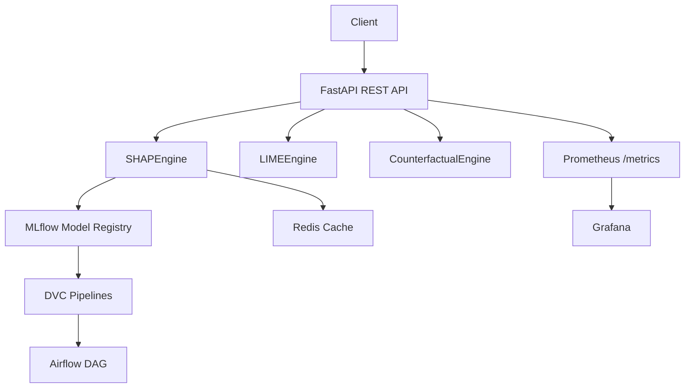

# Explainable AI Demos with SHAP

<div align="center">

**Enterprise-grade · Research-quality · Production-ready · MLOps-enabled**

[](https://python.org)
[](https://fastapi.tiangolo.com)
[](https://shap.readthedocs.io)
[](https://github.com/your-org/Explainable-AI-Demos-with-SHAP/blob/main/LICENSE)

</div>

---

## What is this platform?

**Explainable AI Demos with SHAP** is a production-grade platform for generating, serving, and monitoring machine learning model explanations. It addresses the fundamental challenge of making black-box AI models interpretable — a prerequisite for deployment in regulated industries and high-stakes decision-making.

!!! success "Core Capabilities"
    - **SHAP Explanations** — TreeExplainer, LinearExplainer, GradientExplainer, model-agnostic
    - **LIME Cross-Validation** — Independent attribution signal for explanation robustness
    - **Counterfactual Explanations** — "What if" actionable recourse generation
    - **FastAPI REST Service** — Async, JWT-authenticated explanation API
    - **MLOps Pipeline** — Optuna HPO, MLflow tracking, DVC versioning, Airflow orchestration
    - **Drift Detection** — PSI + KS + Jensen-Shannon multivariate monitoring
    - **Kubernetes-Ready** — HPA, Helm charts, Terraform AWS infrastructure

---

## Quick Start

=== "pip"

    ```bash
    git clone https://github.com/your-org/Explainable-AI-Demos-with-SHAP.git
    cd Explainable-AI-Demos-with-SHAP
    pip install -r requirements.txt
    ```

=== "Docker"

    ```bash
    cd docker
    docker compose up -d
    # API: http://localhost:8000
    # MLflow: http://localhost:5000
    # Grafana: http://localhost:3000
    ```

=== "SDK"

    ```python
    from sdk.python.xai_client import XAIClient

    client = XAIClient(base_url="http://localhost:8000", api_key="your-key")
    result = client.explain(
        model_id="churn-ensemble-v2",
        instances=[[0.5, 0.3, 42, 0.0, 2, 1, 1, 0, 1, 75000]],
    )
    result.print_waterfall()
    ```

---

## Why SHAP?

SHAP is grounded in cooperative game theory (Lundberg & Lee, NeurIPS 2017). The Shapley value for feature $i$ is:

$$\phi_i(v) = \sum_{S \subseteq N \setminus \{i\}} \frac{|S|!(|N|-|S|-1)!}{|N|!} \left[ v(S \cup \{i\}) - v(S) \right]$$

SHAP is the **only attribution method satisfying all five Shapley axioms simultaneously**: efficiency, symmetry, linearity, dummy player, and consistency.

| Property | SHAP | LIME | Permutation |
|---|:---:|:---:|:---:|
| Local accuracy (additivity) | ✅ | ✅ | ❌ |
| Consistency | ✅ | ❌ | ❌ |
| Missingness | ✅ | ❌ | ✅ |
| Global + Local | ✅ | Local only | Global only |
| Tree model speed | O(TLD²) | N/A | O(n·evals) |

---

## Architecture Overview



---

## Research Value

This platform implements and demonstrates:

1. **SHAP theoretical foundations** — Shapley value derivation, additivity proofs, background data effects
2. **Explainer comparison** — TreeSHAP vs KernelSHAP vs LIME on identical models (150× speedup benchmark)
3. **Fairness analysis** — Demographic parity difference, equalised odds across gender/geography
4. **Counterfactual recourse** — Gradient-free constrained optimisation for actionable explanations
5. **Calibration analysis** — ECE, reliability diagrams, Brier score for explanation trustworthiness

---

## Platform Components

<div class="grid cards" markdown>

- :material-brain: **[SHAP Engine](architecture/shap-engine.md)**  
  Auto-selects optimal explainer. Async, cached, additivity-verified.

- :material-chart-scatter-plot: **[LIME Engine](architecture/lime-engine.md)**  
  Independent cross-validation signal with SHAP comparison.

- :material-arrow-decision: **[Counterfactual Engine](architecture/counterfactual.md)**  
  Actionable "what-if" explanations with constraint support.

- :material-api: **[REST API](api-reference/rest-api.md)**  
  FastAPI with JWT auth, rate limiting, Redis caching, Prometheus metrics.

- :material-pipe: **[MLOps Stack](mlops/training.md)**  
  Optuna HPO, MLflow, DVC, Airflow — full experiment lifecycle.

- :material-chart-line: **[Drift Detection](mlops/drift.md)**  
  PSI + KS + Jensen-Shannon multivariate monitoring with alerts.

- :material-kubernetes: **[Kubernetes](deployment/kubernetes.md)**  
  HPA, rolling deployments, Helm charts, Ingress TLS.

- :material-terraform: **[Terraform](deployment/terraform.md)**  
  AWS VPC, EKS, RDS, ElastiCache, S3 — fully provisioned.

</div>

---

## Citation

```bibtex
@software{xai_platform_2024,
  title  = {Explainable AI Demos with SHAP: Enterprise Platform},
  year   = {2024},
  url    = {https://github.com/your-org/Explainable-AI-Demos-with-SHAP},
}
```

```bibtex
@inproceedings{lundberg2017unified,
  title     = {A unified approach to interpreting model predictions},
  author    = {Lundberg, Scott M and Lee, Su-In},
  booktitle = {NeurIPS},
  year      = {2017}
}
```
